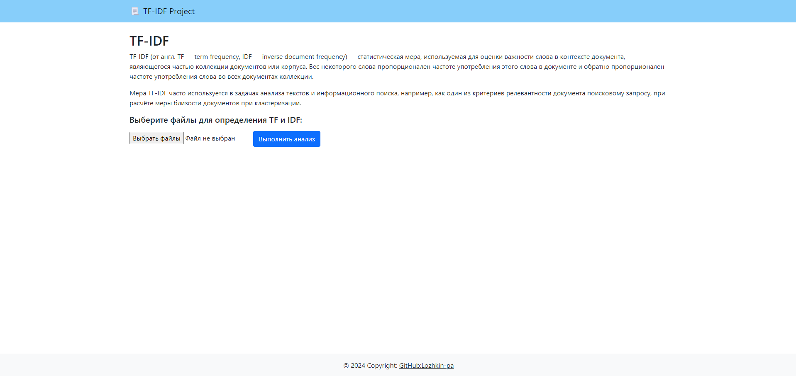
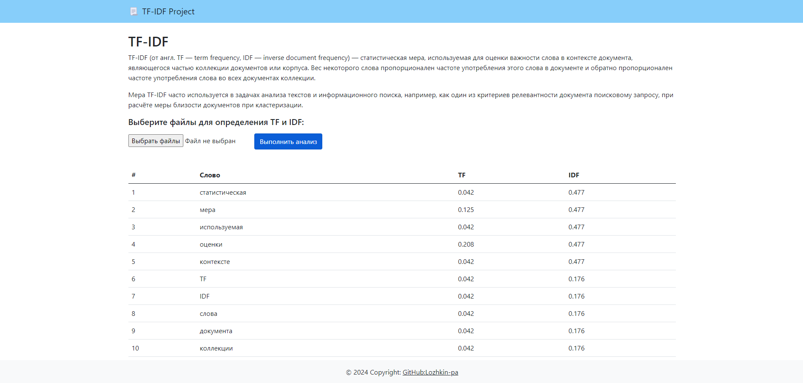

# 📃 TF-IDF Project 
## _Lesta Games test project_

   

Проект представляет собой веб-приложение: в качестве интерфейса выполнена страница с формой для загрузки текстовых файлов, после загрузки и обработки файлов выполняется анализ текста и отображается таблица с колонками (упорядоченными по уменьшению idf):
* Слово
* TF, сколько раз это слово встречается в тексте
* IDF, обратная частота документа

### __Скриншоты веб-приложения__
<div style="display: flex; justify-content: space-between; align-items: center;">
  <a href="./term_frequency_project/data/img/0001.png" style="display: block; margin: 0 auto;">
    
  </a>
  <a href="./term_frequency_project/data/img/0002.png" style="display: block; margin: 0 auto;">
    
  </a>
</div>

### __Установка на локальном компьютере__
1. Клонируйте репозиторий:
    ```
    git clone git@github.com:Lozhkin-pa/lestagames-project.git
    ```
2. Установите и активируйте виртуальное окружение:
    ```
    python -m venv venv
    source venv/Scripts/activate  - для Windows
    source venv/bin/activate - для Linux
    ```
3. Установите зависимости:
    ```
    python -m pip install --upgrade pip
    pip install -r requirements.txt
    ```
4. Перейдите в папку term_frequency_project и выполните миграции:
    ```
    cd term_frequency_project
    python manage.py migrate
    ```
5. Запустите проект:
    ```
    python manage.py runserver
    ```
### __Технологии__
* [Python 3.10.12](https://www.python.org/doc/)
* [Django 5.0.4](https://docs.djangoproject.com/)
* [HTML5](https://html.com/document/)
* [Bootstrap 4.1](https://getbootstrap.com/docs/4.1/getting-started/introduction/)

### __Автор__
[Павел Ложкин](https://github.com/Lozhkin-pa)
